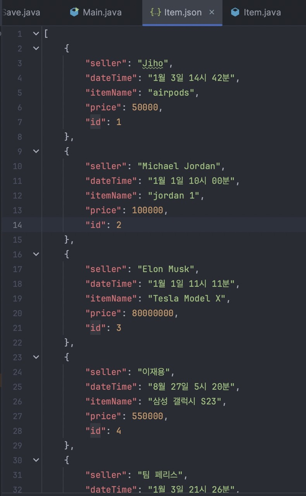
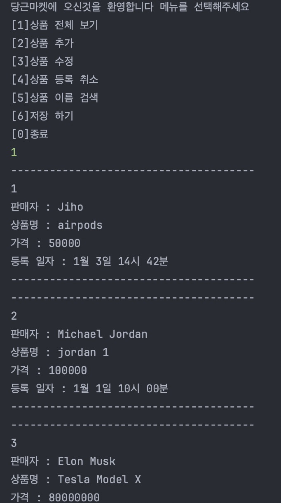

## 주제 : 당근마켓 CRUD 기능 구현 + File I/O

#### 조건
- [x] ArrayList, Scanner, BufferedReader, DateTimeFormatter class 사용
- [x] 조회할 때 데이터 처음 번호는 1번 부터
- [x] 수정, 삭제시 조회 메뉴의 리스트를 보여준 후 원하는 번호를 입력받은 후 번호에 해당하는 데이터를 수정이나 삭제 기능 구현


#### 주요 기능
- [x] 파일관리
  - [x] 파일저장
  - [x] 파일에서 데이터 읽어오기

    ````
    예시)
    파일명 / 파일저장할 위치 
    String path = Paths.get(".").toAbsolutePath().toString();
    String filename = path + "/data.txt";
    
    파일저장
    PrintWrite printWriter = new PrintWriter(new FileWriter(filename));
    printWriter.write("이름/국어/영어/수학");
    printWriter.close();
    
    파일에서 데이터 읽어오기
    File file = new File(filePath); // File객체 생성 
    if(file.exists()){ 
        BufferedReader reader = new BufferedReader(new FileReader(file));
        System.out.println("파일내용 출력------------------"); 
        String line = null; 
        while ((line = reader.readLine()) != null){ 
            System.out.println(line);
        } 
        System.out.println("------------------------------"); 	
        reader.close(); 
    }
    
    파일에서 읽어오는 함수는 프로그램이 시작되면 바로 실행되고 ArrayList객체로 가져와야 하고, 자유롭게 데이터를 다루다가 저장을 선택하면 모든 데이터가 새롭게 파일에 저장.
    데이터 저장포맷은 json을 사용해도 되고, 포맷을 정하여 사용해도 됨.

    ````

- [ ] 조회 (상품 조회)
  - [x] 등록된 상품 들을 모두 출력 한다
  - [x] 각 제품별 줄바꿈 처리를 한다
  - [x] 가격, 상품명, 등록 일자 그리고 판매자를 모두 출력 한다. 
  - [ ] 가격과 등록 일자 순으로 정렬할 수 있도록 구현 한다. (기본은 등록 일자 순, 가격은 낮은 순)
- [x] 추가 (상품 추가)
    - [x] 판매자, 가격, 상품명 그리고 등록 일자 모두 입력 받는다.
    - [x] 상품 가격은 0원부터 1억원(100000000)이하의 값으로 설정 한다. 
    - [x] DateTimeFormatter 사용하여 날짜 관리
- [x] 수정 (상품 수정)
    - [x] 판매자를 입력 받고 판매자를 등록한 모든 상품 목록을 출력 한다.
      - [x] 수정할 상품의 index를 입력 받는다.
      - [x] 수정할 상품의 가격, 상품명, 등록 일자 그리고 판매자를 입력 받는다.
- [x] 삭제 (상품 삭제)
    - [x] 판매자를 입력 받고 판매자가 등록한 모든 상품 목록을 출력 한다.
    - [x] 삭제할 상품의 index를 입력 받는다.
    - [x] 삭제 경고 문구가 출력 되고 "Yes"를 입력 받으면 삭제 한다.
    - [ ] 앞의 요소가 삭제 된다면 index 자동으로 정렬 되도록
- [ ] 검색 (상품 검색)
    - [x] 상품 명을 입력 받아 일치 하는 상품이 있을 경우 출력 한다.
    - [x] 상품명이 동일한 상품이 있을 경우 가격 낮은 순으로 정렬 하여 출력 한다.
        - [ ] 상품과 가격이 모두 동일 하다면 등록 일자 순으로 정렬 하여 출력 한다.
- [ ] 종료
    - [x] 종료 경고 문구가 출력 되고 "Yes"를 입력 받으면 삭제 한다.
#### 예외 처리
- [x] 상품 가격이 0원부터 1억원(100000000)이하의 값이 아니 라면 에러 메시지를 출력 하고 다시 입력 받는다.
- [X] 공백이 입력되면 에러 메시지를 출력하고 다시 입력 받는다.
  - [x] 상품 수정에서는 수정할 내용이 아닌 내용은 공백 처리 가능
- [x] 등록된 상품이 없을때 상품 전체 보기를 선택하면 에러 메시지 출력

#### 추가 구현 사항
- [ ] db 연결
  - [ ] id index 로직 수정
  - [ ] 등록 일자, 가격 순 정렬
- [x] File IO

---

### Classes
- constant
  - Constant : 자주 사용 되는 숫자를 관리
  - ErrorMessage(Enum) : 잘못된 입력을 받았을 때 출력할 에러 메세지를 관리
- controller
  - KarrotMarketController : 입력값에 따른 프로그램의 전체적인 실행을 관리
- crud
  - Create : 상품 추가 기능
  - Read : 상품 이름 검색 기능
  - Update : 상품 수정 기능
  - Delete : 상품 등록 취소 기능
- view
  - InputView : 사용자 입력과 예외 처리
  - OutputView : 화면에 보여지는 출력을 담당
- item
  - Item : 상품 데이터 관리
  - Item.json : 상품 데이터 포멧
- Main : 프로그램 시작과 controller와의 연결 다리 역할

### Libraries

- import org.json.JSONArray;
- import org.json.JSONObject;
- import java.io.FileWriter;
- import java.io.IOException;
- import java.nio.file.Files;
- import java.nio.file.Paths;

### 실행 화면, 데이터 포멧






### 느낀점
- 이번 과제2는 과제 1에서 기존에 작성 했던 코드에 파일 입출력 기능을 추가하는 과제였습니다. 과제 1때 최대한 기능을 분리 하려고 해서 이번에
기능을 추가하는데 있어서 큰 어려움이 없었습니다. txt 파일 입출력은 해본적이 있었고 Json형식으로 파일 입출력은 처음 해보았는데, 처음엔 헷갈리기도
했지만 익숙해 지니 오히려 정리가 잘 되고 이후 데이터 관리할때 더욱 용이 하겠다는 생각을 했습니다.
